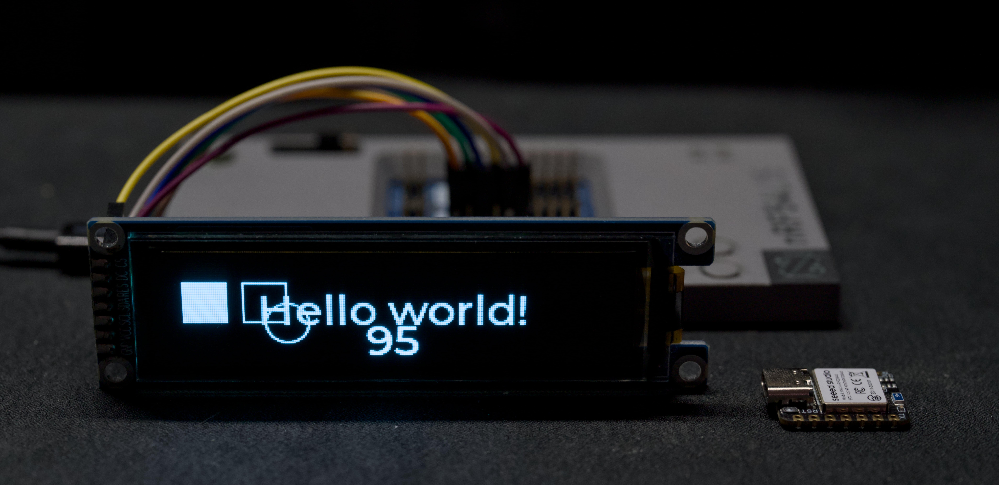

# SSD1362 Display Driver

Zephyr display driver module for the Solomon SSD1362 OLED controller on SPI, supporting 1-bit monochrome and 4-bit grayscale (via RGB565 from LVGL).

Tested with ZJY312S0700WG11 display module and nRF54L15 DK.



> [!NOTE]
> This module targets Zephyr 4.1 only.

## Devicetree

```dts
/ {
    chosen {
        zephyr,display = &ssd1362;
    };

    mipi_dbi_ssd1362 {
        compatible = "zephyr,mipi-dbi-spi";
        spi-dev = <&spi00>;
        dc-gpios = <&gpio2 6 GPIO_ACTIVE_HIGH>;
        reset-gpios = <&gpio2 8 GPIO_ACTIVE_LOW>;
        write-only;
        #address-cells = <1>;
        #size-cells = <0>;

        ssd1362: ssd1362@0 {
            compatible = "solomon,ssd1362";
            reg = <0>;
            mipi-max-frequency = <8000000>;
            width = <256>;
            height = <64>;
            remap-columns;
            remap-nibble;
            remap-com-odd-even-split;
            remap-com-dual;
            contrast = <127>;
            iref-external;
        };
    };
};
```

## Configuration

### Mono mode (1-bit)

```
CONFIG_DISPLAY=y
CONFIG_LV_COLOR_DEPTH_1=y
CONFIG_LV_Z_BITS_PER_PIXEL=1
```

### Grayscale mode (16-bit to 4-bit gray)

```
CONFIG_DISPLAY=y
CONFIG_LV_COLOR_DEPTH_16=y
CONFIG_LV_Z_BITS_PER_PIXEL=16
CONFIG_LV_Z_AREA_X_ALIGNMENT_WIDTH=2
```
